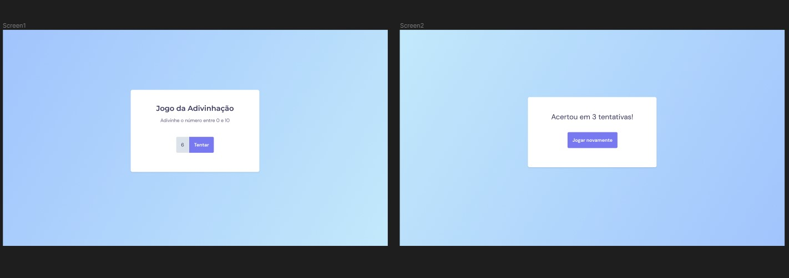

<h1 align="center">Jogo de adivinhação</h1>

Mais um pequeno projeto para consolidar ao máximo minha base em JavaScript Vanilla.

 

Tecnologias utilizadas:
 HTML e CSS
 JavaScript Vanilla
 Git e GitHub

